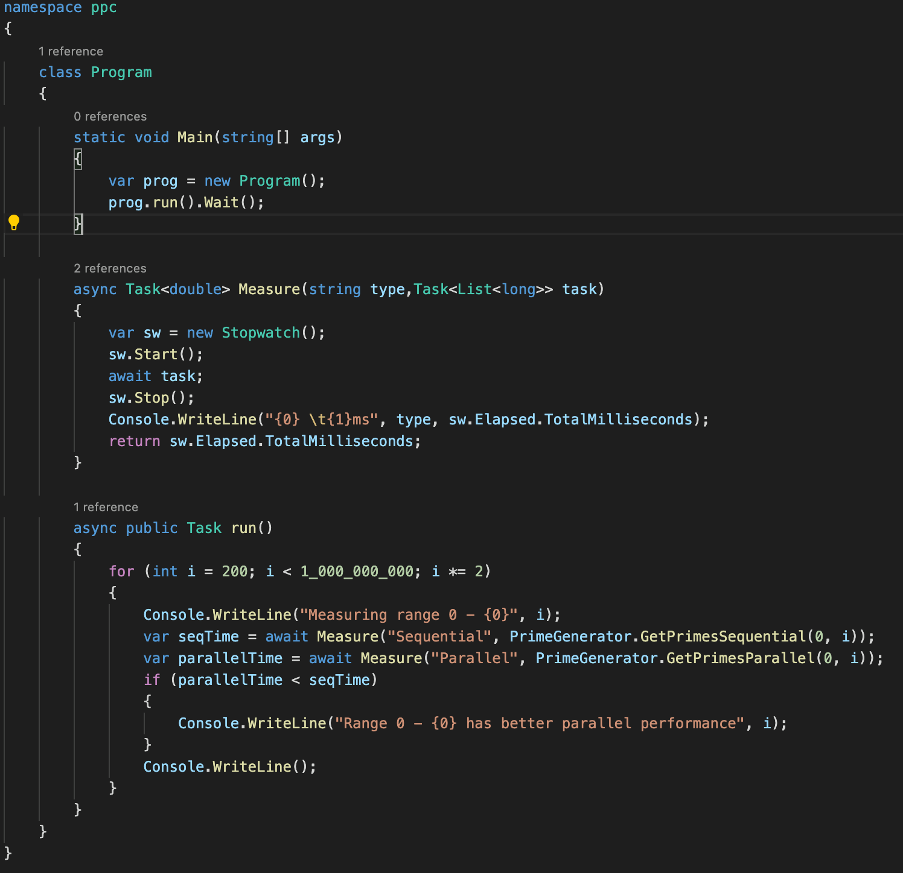
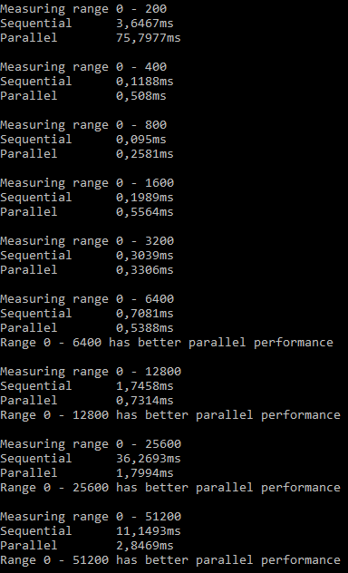

# Parallel-Programming-Compulsory

Compulsory project for the subject Parallel Programming.

**Functional Requirements:**

Create two functions in a PrimeGenerator class:

> List<long> GetPrimesSequential(long first, long last)

> List<long> GetPrimesParallel(long first, long last)

to return a sorted list of all prime numbers in a given range, say between 1.000.000 and 2.000.000. (A number is a prime number if only 1 and the number itself can divide the number).
1. First implement the function using a sequential approach, and check for correctness.
2. Then implement the function using parallel programming, and check for correctness (take care of race conditions when writing in parallel to the list).
3. Compare the performance of both methods for various ranges, like:
    - 1 – 1.000.000
    - 1 – 10.000.000
    - 1.000.000 – 2.000.000
    - 10.000.000 – 20.000.000
    
    Is there a range start value, after which the parallel implementation will always be better than the sequential implementation? [solution](#assignment3)
    
4. Create a GUI for the prime number program. The GUI should allow the user to specify the range for the prime search and of course be non-freezing while the prime search is on-going. The result must be displayed into a list box.

<h3>
    <a name="assignment3">Assignment 3:</a>
</h3>

As the image presented below indicates, the turning point between the sequential and the parallel implementation is between 3200 - 6400.

